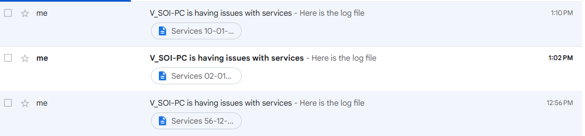

# Service Monitoring and Alert Script

## Overview
This PowerShell script monitors specified Windows services, logs any discrepancies between the current status and desired status, attempts to correct any misaligned statuses, and sends an email alert with the log file attached if any services are found in an unexpected state. The email is sent using the `MailKit` and `MimeKit` libraries to handle SMTP authentication and email composition.

## Features
- **Service Monitoring**: Reads a list of services and their desired statuses from a CSV file.
- **Automatic Correction**: Attempts to correct the status of any service that doesn’t match the desired state.
- **Logging**: Records each check, status change attempt, and final outcome in a timestamped log file.
- **Email Alerts**: Sends an email alert with the log file attached if any issues are detected.


---

## Requirements
- **PowerShell**: This script requires PowerShell 5.1 or higher.
- **NuGet Package Manager**: For installing the `MailKit` and `MimeKit` libraries.
- **Permissions**: Ensure you have administrator permissions to start and stop Windows services.
- **Gmail Account for SMTP**: If using Gmail, make sure you have set up app passwords for secure access.

### Libraries
The following libraries are required and should be installed through PowerShell:
- [MailKit](https://www.nuget.org/packages/MailKit/)
- [MimeKit](https://www.nuget.org/packages/MimeKit/)

To install these:
```powershell
Install-Package -Name MailKit -Source "NuGet.org"
Install-Package -Name MimeKit -Source "NuGet.org"
```

## Setup

1. **Download the Script**: Save the script as `ServiceChecker.ps1`.
2. **Create a CSV File for Services**: In the same directory, create a file named `Services.csv` with two columns:
   - `Name`: The name of each service to monitor.
   - `Status`: Desired status of the service (e.g., `Running`, `Stopped`).

   Example `Services.csv`:
   ```csv
   Name,Status
   Spooler,Stopped
   WinDefend,Running
   W32Time,Running
   ```

3. **Setup Gmail Credentials**: Securely export your Gmail credentials to an XML file using:
   ```powershell
   $cred = Get-Credential
   $cred | Export-Clixml -Path "C:\Path\To\gmail.xml"
   ```
   Replace `C:\Path\To\` with the path where the file should be saved. Update the path in the script to point to this file.

4. **Log File Directory**: Ensure the specified `LogFilePath` exists, or update it as needed.

5. **Install Required Libraries**: Ensure `MailKit` and `MimeKit` are installed, as described in the Requirements section.

## Usage

Run the script by executing the following command in PowerShell:

```powershell
.\ServiceChecker.ps1
```

### Script Actions
1. **Loads Libraries**: Adds `MailKit` and `MimeKit` for email handling.
2. **Imports Service List**: Reads the `Services.csv` file for services to monitor.
3. **Checks and Corrects Service Status**: Compares each service’s status with the desired status, attempts corrections, and logs the results.
4. **Email Notification**: If issues are detected, an email with the log file attached is sent.

### Example Log Output
Each log entry records the service name, current status, and action taken. Example log:
```
Service: Spooler is currently Running, should be Stopped
Setting Spooler to Stopped
Action was successful, service Spooler is now Stopped
```

## Customization

- **Modify the Email Recipient**: Update `$Message.To.Add("recipient@example.com")` in the script to change the recipient.
- **Add Additional Services**: Simply add more rows to the `Services.csv` file to monitor additional services.
- **Adjust Log Directory**: Change `$LogFilePath` to specify a different directory for logs.

---

## Troubleshooting

1. **SMTP Connection Issues**: Ensure SMTP server (`smtp.gmail.com`) and port (`587`) are correct for Gmail. Verify `StartTls` security setting.
2. **Service Permission Denied**: Ensure you’re running the script as an administrator to manage service statuses.
3. **Log File Not Found**: Ensure `$LogFilePath` is correctly set and the directory exists.
4. **Obsolete `Send-MailMessage` Warning**: This script avoids `Send-MailMessage` by using `MailKit` for secure email handling.

## Security Considerations
- **Secure Credentials**: Keep the `gmail.xml` file in a secure location, as it stores your credentials.
- **Email Security**: Gmail accounts may require enabling app passwords and two-factor authentication for enhanced security.

---

## License
This script is open-source and can be modified or distributed. Attribution to the original author is appreciated.

---

This README provides an in-depth guide to setting up, customizing, and using the service monitoring script, along with troubleshooting and security tips for reliable usage.
